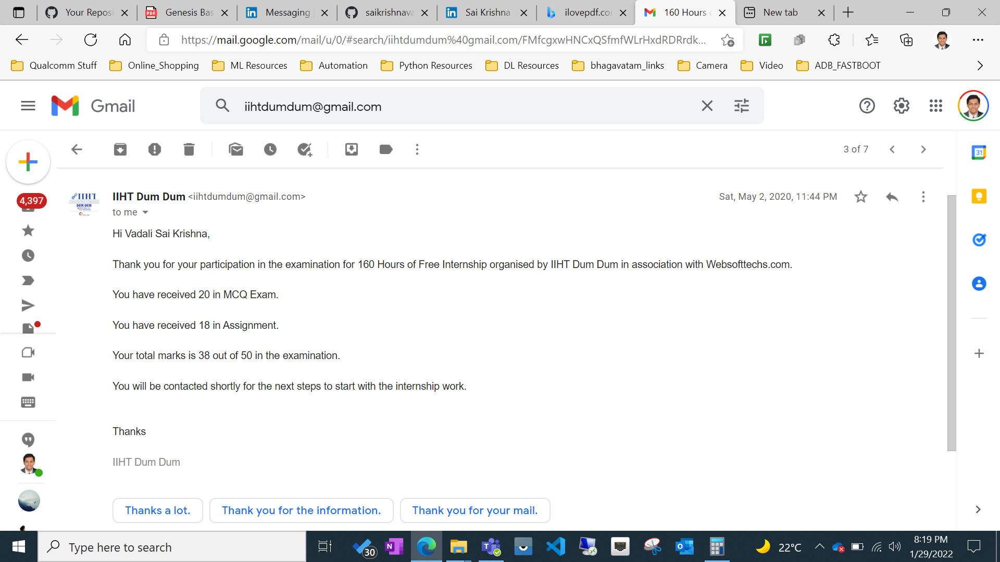

# Websofttech-Internship-Test
This End-to-End Application is built by me to in order to qualify in the Websofttech Internship Test conducted by IIHT DUM DUM (Kolkata).
* This test is for 20 marks
* Written test is for 30 marks

### Achievement 
1. I got qualified in this test.
2. I had cleared the python written test also.

Approximately, 200 members applied for this test.
I have scored a total of 38/50 and got placed in the internship.

> I am one among the 5 participants who got qualified in this test.

